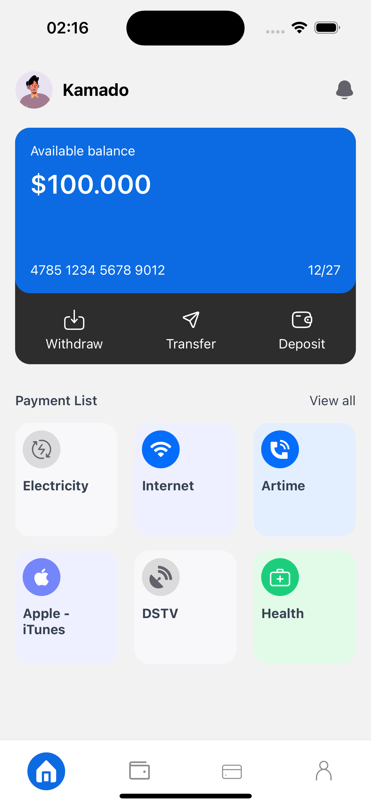

# React Native Wallet Application

## Description

Cette application mobile est une solution de gestion de portefeuille qui permet aux utilisateurs de visualiser leur solde disponible, d'effectuer des transactions (retrait, transfert, dépôt) et d'accéder rapidement à divers services de paiement tels qu'électricité, internet, santé, et plus encore.

L'interface est conçue pour être intuitive et moderne, offrant une expérience utilisateur agréable et simple.

## Fonctionnalités

- **Affichage du solde disponible** : Consultez le montant actuel de votre portefeuille.
- **Gestion des transactions** : Effectuez des retraits, transferts et dépôts directement depuis l'application.
- **Liste des paiements** : Accédez rapidement aux options de paiement courantes comme l'électricité, internet, santé, et autres.
- **Navigation intuitive** : Navigation facile entre les différentes sections via une barre de navigation inférieure.

## Capture d'écran

## Capture d'écran

